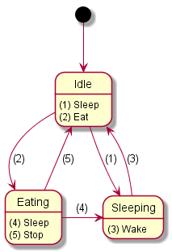

# State Machine

[](https://badge.fury.io/js/%40working-sloth%2Fstate-machine)
[](https://travis-ci.org/work-work-komei/node.state-machine)
[](https://app.codacy.com/app/work-work-komei/node.state-machine?utm_source=github.com&utm_medium=referral&utm_content=work-work-komei/node.state-machine&utm_campaign=Badge_Grade_Dashboard)
[](LICENSE)



注: まだβ版です

日々怠ける処の開発者、日没する処の社畜開発者に致す。
ステートマシンを１から作ったり貧弱なステートマシンのお世話があなたの仕事ですか？
怠けましょう

## 概要
 JavaScriptとTypeScript用のステートマシンです

## 特徴
- シンプル: 使い方が簡単で、コードが短くなります
- ジェネリック型対応: ステート、アクション、オプション引数すべて
- Rich state: ステートオブジェクトにユーザー定義クラスが使えます
- ライフサイクル: 生成/破棄
- 状態遷移図のエクスポート: PlantUML

## Quick start

### case: String state (最もシンプル)
```js
import { StateMachine } from '@working-sloth/state-machine';

enum SlothState {
    Idle = 'Idle',
    ...
}

enum SlothAction {
    Sleep = 'Sleep',
    ...
}

const fsm = StateMachine.fromString<SlothState, SlothAction>(
    'Sloth State', // state machine name
    SlothState.Idle, // start state
    {
        state: SlothState.Idle,
        actions: [
            [SlothAction.Sleep, SlothState.Sleeping],
            [SlothAction.Eat, SlothState.Eating],
        ]
    }, {
        state: SlothState.Sleeping,
        actions: [
            [SlothAction.Wake, SlothState.Idle],
        ]
    },
    ...
);

console.log(fsm.current);

fsm.start(); // Don't forget

if (fsm.can(SlothAction.Sleep)) {
    fsm.do(SlothAction.Sleep);
}
```

### case: Named static state (rich state)
 真に驚くべきサンプルがあるが、ここに書くには余白が狭すぎる
 [See samples](samples)

### case: Typed dynamic state (ライフサイクル付きrich state)
 真に驚くべきサンプルがあるが、ここに書くには余白が狭すぎる
 [See samples](samples)

## 予定
- PlantUMLからの逆変換: 明日やる
- ステートのネスト: 明日やる
- カバレッジチェック: 明日やる
- ドキュメントの充実: 明日やる
- リリース v1.0: 明日やる
- 休憩: 毎日
- おふとん: 毎日
- 有能な怠け者になる: もうすぐ
- 無能な働き者になる: 一昨日

## ご満足いただけなかった場合
 ここに連絡：koba.work.work1127@gmail.com
